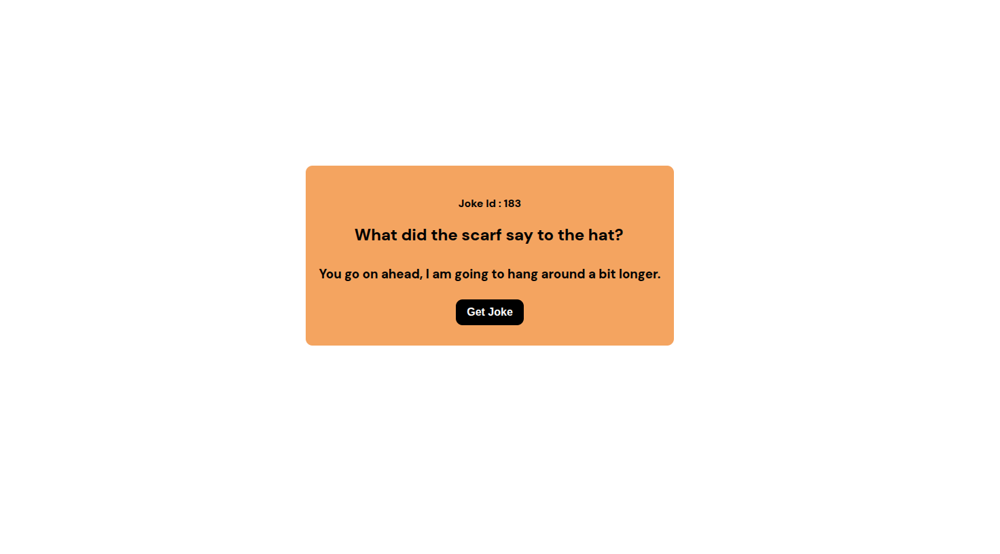

# 😂 Joke Generator App

A simple **ReactJS project** that fetches random jokes from the [Official Joke API](https://official-joke-api.appspot.com/random_joke).  
Each time you click the **Get Joke** button, a new joke will be displayed.

---

## 🚀 Features
- Fetches random jokes from an API.
- Displays **Joke ID, Setup, and Punchline**.
- Clean UI styled with **CSS / Tailwind**.
- Fully responsive design.

---

## 📸 Screenshot

---

## 🛠️ Tech Stack
- **React.js** (Frontend framework)
- **Fetch API** (for making API calls)
- **CSS ** (for styling)

---
